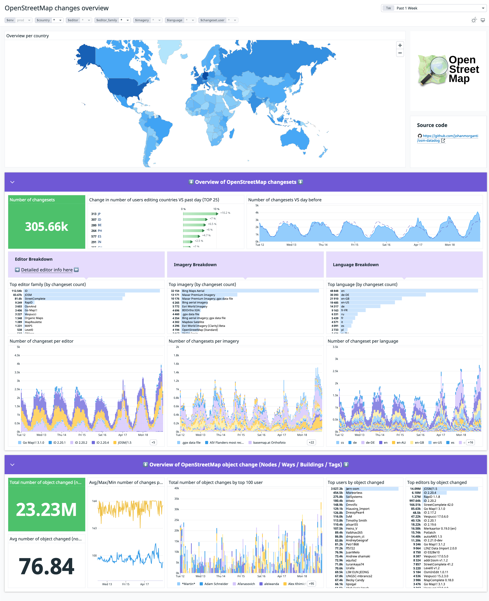

# osm-datadog
Monitoring OpenStreetMap with Datadog

[The work in progress can be seen as this URL](https://osm-monitor.com)

## Setup

This script relies on those env variables : 
- DD_API_KEY (mandatory)
- DD_TAGS (recommended), should a string of comma separated values (ex : `"env:staging,version:5.1"`)
- DD_SITE (optional, defaults to "datadoghq.com")
- SEQUENCE_START = Starting sequence number

Run `upload_changesets_from_replication.py` with those environement variables from a terminal or use a container using the `Dockerfile` provided (no public image).

## Demo

I have iframed the Datadog dashboard in a more readable domain name here :

* https://osm-monitor.com

## TODO

Previous TODO list

 

- [x] Send the 100 most recents changesets to Datadog
- [x] Prevent sending duplicates
- [x] log API calls are not optimized : for now doing one API call per changeset
- [x] Need to leverage `<tag />` within the changeset
- [x] Parse box to extract countries values to be able to use the [Geomap Widget](https://docs.datadoghq.com/dashboards/widgets/geomap/#configuration). Idea : https://pypi.org/project/reverse_geocoder/
- [x] Clean editors (solution done on Datadog side, "editor family" created)
- [x] add log creation to the utilities
- [x] Clean imageries
- [ ] Add some try / catches with better logging
- [ ] Share Datadog pipelines
- [ ] Use case :  need to be alerted when a bad changeset occurs (vandalism). First need definition of a bad changeset : having a lot of deletion?
- [ ] How to prevent counting some changeset multiple times?
        - Some changeset have a discussion, so they might be pushed to the replica at each discussion update : example with changeset `118161820` in `https://planet.osm.org/replication/changesets/004/878/999.osm.gz`
        

---

TODO was moved to issues : https://github.com/johanmorganti/osm-datadog/issues

## Contact

If you have any questions / feedback / ideas, feel free to open an issue or ping me at `osm-monitor@johan.sh`
